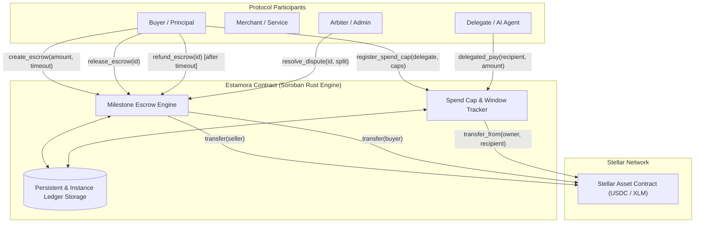

# Estamora Contracts

[](https://github.com/Estamora-Soroban-Layers/estamora-contracts/actions/workflows/ci.yml)
[](https://stellar.org)
[](LICENSE)
[](target/wasm32v1-none/release/estamora_payments.wasm)

> **Policy-guarded milestone escrow, dispute resolution, and delegated spend-cap micro-payments on Stellar (Soroban).**

Part of the **Estamora Payment Protocol**:
- 📜 **[estamora-contracts](https://github.com/Estamora-Soroban-Layers/estamora-contracts)** — Soroban smart contracts in Rust (this repository).
- ⚡ **[estamora-sdk](https://github.com/Estamora-Soroban-Layers/estamora-sdk)** — TypeScript client SDK, RPC pre-flight simulation engine, and framework middleware.
- 💻 **[estamora-app](https://github.com/Estamora-Soroban-Layers/estamora-app)** — Merchant dashboard, checkout simulator, and Freighter wallet operator console ([Live App](https://estamora-app.vercel.app)).
- 📚 **[estamora-docs](https://github.com/Estamora-Soroban-Layers/estamora-docs)** — Technical documentation, guides, and specification hub ([Live Docs](https://estamora-docs.vercel.app)).

---

## 1. Product In Action & Live Operation

Estamora Contracts provide the deterministic on-chain accounting and state transition engine powering decentralized payments across the Stellar ecosystem.

### Milestone Escrow & Dispute Resolution Flow
Contracts maintain immutable state machines ensuring buyer deposits remain safely locked in contract custody until delivery milestones are satisfied or dispute resolution is enacted.


### Testnet Contract Telemetry & Verified Execution
The contracts are actively deployed and verified on Stellar Testnet, processing real-time calls across Stellar Asset Contracts (SAC).


---

## 2. Overview & Core Primitives

**Estamora Payments** brings programmable escrow, conditional releases, and policy-guarded delegated payments to Stellar. Built natively on **Soroban**, the contract implements three foundational financial primitives:

1. **Milestone & Time-Locked Escrows**: Buyers deposit funds into contract custody. Funds are unlocked upon delivery confirmation or automatically refunded to the buyer if delivery timeouts lapse.
2. **Fair Split Dispute Arbitration**: Neutral arbiters or multisig governance can allocate percentage settlements between parties (e.g. 60% refund / 40% release) in contested scenarios.
3. **Delegated Spend Caps for Autonomous Agents & Services**: Account owners delegate controlled spending permissions to secondary accounts (AI agents, automated services) with strict per-transaction and rolling 24-hour limits.
4. **Native Stellar Asset Contract (SAC) Support**: Direct interoperability with native XLM and tokenized stablecoins such as USDC via standard Soroban token client interfaces.

---

## 3. Protocol Architecture



---

## 4. Contract Interface Reference

### Milestone Escrow Methods

| Function | Parameters | Description |
| :--- | :--- | :--- |
| `create_escrow` | `buyer, seller, token, amount, timeout_secs, memo` | Locks `amount` in contract custody; emits `escrow_created`. |
| `release_escrow` | `caller, escrow_id` | Transfers escrow funds to `seller`. Caller must be `buyer` or `admin`. |
| `refund_escrow` | `caller, escrow_id` | Returns escrow funds to `buyer`. Allowed if timeout elapsed or caller is `seller`. |
| `dispute_escrow` | `caller, escrow_id` | Freezes release/refund pending arbitration. Caller must be `buyer` or `seller`. |
| `resolve_dispute`| `admin, escrow_id, buyer_pct, seller_pct` | Splits escrow amount according to percentages (must total 100%). |
| `get_escrow` | `escrow_id` | Returns `Escrow` struct: state, balances, timestamps, and parties. |
| `get_escrow_count`| — | Returns total escrows instantiated. |

### Delegated Spend Cap Methods

| Function | Parameters | Description |
| :--- | :--- | :--- |
| `register_spend_cap` | `owner, delegate, token, per_tx_cap, daily_cap` | Authorizes `delegate` to spend up to specified limits. |
| `delegated_pay` | `delegate, owner, recipient, token, amount` | Executes payment from `owner` allowance, updating 24h rolling totals. |
| `revoke_spend_cap` | `owner, delegate, token` | Disables spend permissions for `delegate`. |
| `get_spend_cap` | `owner, delegate, token` | Reads active limits, window timestamp, and amount spent in window. |

---

## 5. Security Architecture & Risk Controls

1. **Strict Cryptographic Authorization**: All mutating functions enforce `require_auth()` on caller addresses to prevent unauthorized access or privilege escalation.
2. **Reentrancy Protection**: Follows checks-effects-interactions ordering. State transitions are committed to storage prior to initiating cross-contract token transfers.
3. **Ledger Storage Longevity (`extend_ttl`)**: Actively manages instance and persistent storage entry TTLs, preventing active escrows or spend-cap states from expiring or archiving.
4. **Arithmetic Safety**: Uses checked math across all monetary calculations to guard against overflows and precision rounding exploits.

---

## 6. Live Testnet Deployment

- **Contract ID**: `CADQOBYHA4DQOBYHA4DQOBYHA4DQOBYHA4DQP5KR`
- **Network**: Stellar Testnet
- **RPC Endpoint**: `https://soroban-testnet.stellar.org`
- **Network Passphrase**: `Test SDF Network ; September 2015`
- **WASM Size**: **26,247 bytes** (optimized release build)

---

## 7. Build & Test Instructions

### Prerequisites
- Rust 1.84+ with `wasm32v1-none` target installed:
  ```bash
  rustup target add wasm32v1-none
  ```
- Soroban CLI / Stellar CLI installed:
  ```bash
  cargo install --locked stellar-cli --features opt
  ```

### Build Contracts
```bash
# Build optimized WebAssembly contract
cargo build --target wasm32v1-none --release
```

### Run Automated Tests
```bash
# Run unit tests and invariant checks
cargo test

# Run Clippy static analysis
cargo clippy --all-targets -- -D warnings

# Format code
cargo fmt --all
```

---

## License

Licensed under the Apache License, Version 2.0. See [LICENSE](LICENSE) for details.
