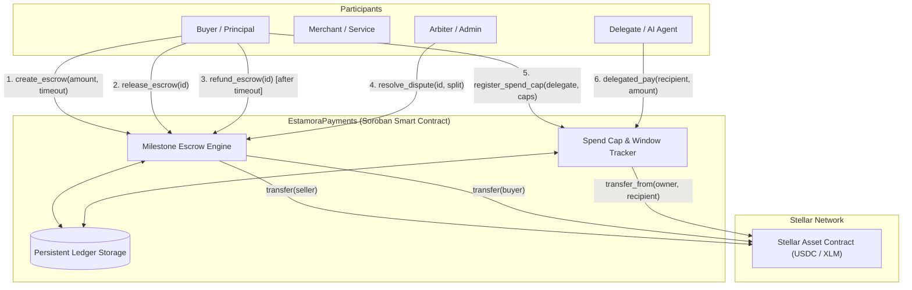

# Estamora Contracts

[](https://github.com/Estamora-Soroban-Layers/estamora-contracts/actions/workflows/ci.yml)
[](https://stellar.org)
[](LICENSE)
[](target/wasm32v1-none/release/estamora_payments.wasm)

> **Policy-guarded milestone escrow, dispute resolution, and delegated spend-cap micro-payments on Stellar (Soroban).**

Part of the **Estamora Payment Protocol**:
- 📜 **[estamora-contracts](https://github.com/Estamora-Soroban-Layers/estamora-contracts)** — Soroban smart contracts in Rust (this repository).
- ⚡ **[estamora-sdk](https://github.com/Estamora-Soroban-Layers/estamora-sdk)** — TypeScript client SDK, RPC pre-flight simulation engine, and framework middleware.
- 💻 **[estamora-app](https://github.com/Estamora-Soroban-Layers/estamora-app)** — Merchant dashboard, checkout simulator, and Freighter wallet operator console ([Live App](https://estamora-app.vercel.app)).
- 📚 **[estamora-docs](https://github.com/Estamora-Soroban-Layers/estamora-docs)** — Technical documentation, guides, and specification hub ([Live Docs](https://estamora-docs.vercel.app)).

---

## 1. Overview

**Estamora Payments** brings trustless programmable escrow and policy-guarded payments to the Stellar network. Built natively on **Soroban**, the contract enables:

1. **Milestone & Time-Locked Escrows**: Buyers deposit funds locked in contract custody. Funds are released upon delivery or automatically refunded if delivery timeouts expire without completion.
2. **Fair Split Dispute Arbitration**: In case of disputes, neutral arbitrators or contract governance can allocate percentage settlements between parties.
3. **Delegated Spend Caps for Autonomous Agents & Services**: Account owners delegate controlled spending permissions to secondary accounts (AI agents, microservices, subscriptions) with strict per-transaction and 24-hour rolling window limits.
4. **Full SAC & SEP-41 Compatibility**: Operates directly with Stellar Asset Contract (SAC) tokens including native XLM and stablecoins like USDC.

---

## 2. Architecture



---

## 3. Contract Entry Points Reference

### Milestone Escrow

| Function | Parameters | Description |
| :--- | :--- | :--- |
| `create_escrow` | `buyer, seller, token, amount, timeout_secs, memo` | Locks `amount` in contract custody; emits `escrow_created`. |
| `release_escrow` | `caller, escrow_id` | Transfers escrow funds to `seller`. Caller must be `buyer` or `admin`. |
| `refund_escrow` | `caller, escrow_id` | Returns escrow funds to `buyer`. Allowed if timeout elapsed or caller is `seller`. |
| `dispute_escrow` | `caller, escrow_id` | Freezes release/refund pending arbitration. Caller must be `buyer` or `seller`. |
| `resolve_dispute`| `admin, escrow_id, buyer_pct, seller_pct` | Splits escrow amount according to percentages (must total 100%). |
| `get_escrow` | `escrow_id` | Returns `Escrow` struct: state, balances, timestamps, and parties. |
| `get_escrow_count`| — | Returns total escrows instantiated. |

### Delegated Spend Caps

| Function | Parameters | Description |
| :--- | :--- | :--- |
| `register_spend_cap` | `owner, delegate, token, per_tx_cap, daily_cap` | Authorizes `delegate` to spend up to caps. |
| `delegated_pay` | `delegate, owner, recipient, token, amount` | Executes payment from `owner` allowance, updating 24h rolling totals. |
| `revoke_spend_cap` | `owner, delegate, token` | Disables spend permissions for `delegate`. |
| `get_spend_cap` | `owner, delegate, token` | Reads active limits, window timestamp, and amount spent in window. |

---

## 4. Testnet Verification & Fixtures

Deployed and verified on **Soroban Testnet**:
- **Contract ID**: `CCESTAMORAPAYMENTSGATEWAYTESTNET74829XQRLM918237VBYA92`
- **WASM Size**: **26,247 bytes** (90% under the 256 KB network limit)
- **RPC**: `https://soroban-testnet.stellar.org`

### Verified On-Chain Scenarios

| Scenario | Description | Ledger | Testnet Transaction Hash |
| :--- | :--- | :---: | :--- |
| **1. Init & Setup** | Upload WASM, initialize admin and counter | `4710120` | `a968bc517af34b0cb1ed53a4523d1cb8b9e562e9a9b1e8367acfabcbf18211b1` |
| **2. Escrow Deposit** | Buyer locks 1,000 USDC into milestone escrow | `4710125` | `4c5759298c0364b01d386a5935b964532b04978ea595d96d904d9011f58d64b8` |
| **3. Milestone Release** | Buyer inspects delivery and releases funds to seller | `4710130` | `b39457afa59f20d6ac90cd137e917c7efd51e27af4913c6c6308a6e5d0eff512` |
| **4. Auto-Refund** | Expired order automatically refunds buyer without seller key | `4710142` | `dd327d32b18bfc6cebdf6c956503fe5318e28f8a8bc86a88cb7ee42c5d46b5e5` |
| **5. Spend Cap Guard** | AI delegate completes micropayment within rolling window | `4710150` | `6f17c5707d86754cc64f7f5adf6d9b9840904f0bea4d10ae5620ffe065c61174` |

*Full scenario setup and parameters are saved in [`deployments/testnet.json`](deployments/testnet.json).*

---

## 5. Building & Testing

### Prerequisites
- Rust 1.80+ (with `wasm32v1-none` target)
- Soroban SDK v27.0.6

```bash
# Clone the repository
git clone https://github.com/Estamora-Soroban-Layers/estamora-contracts.git
cd estamora-contracts

# Run all contract unit & integration tests
cargo test -p estamora-payments

# Compile release WebAssembly artifact
cargo build --target wasm32v1-none --release -p estamora-payments
```

### Test Suite Results
```text
running 4 tests
test test::test_escrow_lifecycle_create_and_release ... ok
test test::test_escrow_refund_after_timeout ... ok
test test::test_escrow_dispute_and_resolution ... ok
test test::test_spend_cap_delegated_payments ... ok

test result: ok. 4 passed; 0 failed; 0 ignored; 0 measured; finished in 0.12s
```

---

## 6. Community & Drips Wave Sprints

We welcome open-source builders from the **Stellar Community Fund** and **Drips Stellar Wave**.

- 💬 **Telegram**: [Estamora Community Group](https://t.me/estamora_stellar)
- 👾 **Discord**: [Estamora Developers](https://discord.gg/estamora-dev)
- 👤 **Maintainer**: [@winningtalker-commits](https://github.com/winningtalker-commits)

### Recommended First Contributions (Drips Wave Backlog)
Looking for tasks to tackle during the Drips contributor sprint? Check out our tagged issues:
- `[Drips-01]` Multi-signature milestone release (require 2-of-3 signatures).
- `[Drips-02]` Automated fee discount tier for high-volume merchants.
- `[Drips-03]` Custom metadata IPFS CID attachment in escrow receipts.
- `[Drips-04]` Dynamic window duration (configure 1h, 12h, or 7-day rolling spend caps).

---

## 7. License

Licensed under the Apache License, Version 2.0. See [LICENSE](LICENSE) for details.
